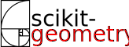

# scikit-geometry



*A Python Geometric Algorithms Library*

The scikit-geometry package contains a whole lot of geometric algorithms. For the moment, scikit-geometry derives most of it’s functionality from the mature and stable Computational Geometry Algorithms Library (CGAL) package, a collection of geometric algorithms written in C++.
Basic Geometric Types

We aim to cleanly encapsulate the important building blocks of a geometric library. As such we have implementations for the basic geometric types:

- `Point2`, `Point3`
- `Segment2`, `Ray2`, `Line2`, `Segment3`, `Ray3`, `Line3`
- `Vector2`, `Vector3`
- `Circle2`
- `IsoRectangle2`, `Bbox2`
- `Plane3`, `Triangle3`
- `Polyhedron3`

All sorts of operations can be performed with these basic building blocks. For example, one can construct a new segment from two points, then test against intersection with another segment, or a line.

```
import skgeom as sg
a = sg.Point2(5, 3)
b = sg.Point2(10, 8)
print(a, b)

>>> PointC2(5, 3), PointC2(10, 8)
```

Now we can create a vector from two points by subtracting one from another.

```
v = a - b
print(v)

>>> VectorC2(-5, -5)
```

Or a segment between two points, where a is the source and b the target.

```
s = sg.Segment2(a, b)
print(s)

>>> Segment_2(PointC2(5, 3), PointC2(10, 8))
```

## Documentation

The docs are hosted on github: [https://scikit-geometry.github.io/scikit-geometry](https://scikit-geometry.github.io/scikit-geometry)

It is built from Jupyter notebooks that can be found under the `/docs` subdirectory.

## License

This software is licensed under the LGPL-3 license. See the [LICENSE](LICENSE) file for details.
